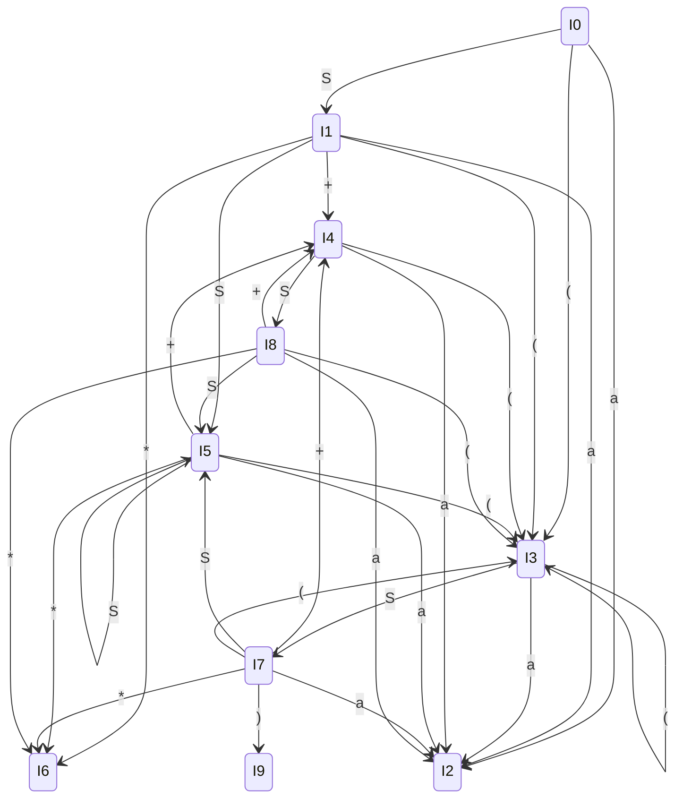

# 文法的 LR(0) 分析

首先，对给定文法 $G(S)$ 进行拓广，引入新的开始符号 $S'$。

**拓广文法** $G'$ **的产生式（并编号）：** (0) $S' \rightarrow S$ (1) $S \rightarrow a$ (2) $S \rightarrow S + S$ (3) $S \rightarrow S S$ (4) $S \rightarrow S *$ (5) $S \rightarrow (S)$

## 1. 构造 LR(0) 项目集族 (States)

根据拓广文法，我们可以求出所有的 LR(0) 项目集（状态）。

$I_0$**:** $S' \rightarrow \cdot S$ $S \rightarrow \cdot a$ $S \rightarrow \cdot S + S$ $S \rightarrow \cdot S S$ $S \rightarrow \cdot S *$ $S \rightarrow \cdot (S)$

$I_1$**:** `goto(I0, S)` $S' \rightarrow S \cdot$ $S \rightarrow S \cdot + S$ $S \rightarrow S \cdot S$ $S \rightarrow S \cdot *$ *(由于* $S \rightarrow S \cdot S$ *中圆点后是非终结符 S，需进行闭包运算添加以下项目)* $S \rightarrow \cdot a$ $S \rightarrow \cdot S + S$ $S \rightarrow \cdot S S$ $S \rightarrow \cdot S *$ $S \rightarrow \cdot (S)$

$I_2$**:** `goto(I0, a)` 等 $S \rightarrow a \cdot$

$I_3$**:** `goto(I0, '(')` 等 $S \rightarrow ( \cdot S)$ *(闭包运算添加)* $S \rightarrow \cdot a$ $S \rightarrow \cdot S + S$ $S \rightarrow \cdot S S$ $S \rightarrow \cdot S *$ $S \rightarrow \cdot (S)$

$I_4$**:** `goto(I1, +)` 等 $S \rightarrow S + \cdot S$ *(闭包运算添加)* $S \rightarrow \cdot a$ $S \rightarrow \cdot S + S$ $S \rightarrow \cdot S S$ $S \rightarrow \cdot S *$ $S \rightarrow \cdot (S)$

$I_5$**:** `goto(I1, S)` 等 $S \rightarrow S S \cdot$ $S \rightarrow S \cdot + S$ $S \rightarrow S \cdot S$ $S \rightarrow S \cdot *$ *(闭包运算添加)* $S \rightarrow \cdot a$ $S \rightarrow \cdot S + S$ $S \rightarrow \cdot S S$ $S \rightarrow \cdot S *$ $S \rightarrow \cdot (S)$

$I_6$**:** `goto(I1, *)` 等 $S \rightarrow S * \cdot$

$I_7$**:** `goto(I3, S)` $S \rightarrow ( S \cdot )$ $S \rightarrow S \cdot + S$ $S \rightarrow S \cdot S$ $S \rightarrow S \cdot *$ *(闭包运算添加)* $S \rightarrow \cdot a$ $S \rightarrow \cdot S + S$ $S \rightarrow \cdot S S$ $S \rightarrow \cdot S *$ $S \rightarrow \cdot (S)$

$I_8$**:** `goto(I4, S)` $S \rightarrow S + S \cdot$ $S \rightarrow S \cdot + S$ $S \rightarrow S \cdot S$ $S \rightarrow S \cdot *$ *(闭包运算添加)* $S \rightarrow \cdot a$ $S \rightarrow \cdot S + S$ $S \rightarrow \cdot S S$ $S \rightarrow \cdot S *$ $S \rightarrow \cdot (S)$

$I_9$**:** `goto(I7, ')')` $S \rightarrow (S) \cdot$

## 2. 画出 LR(0) 自动机 (DFA)

以下是使用 Mermaid 绘制的 LR(0) 自动机状态转移图：

## 3. LR(0) 分析表

其中，`S` 表示移进 (Shift)，`r` 表示归约 (Reduce)，`acc` 表示接受 (Accept)。产生式编号见文档开头。

| 状态  | a         | +         | *         | (         | )    | $    | S (GOTO) |
| ----- | --------- | --------- | --------- | --------- | ---- | ---- | -------- |
| **0** | S2        |           |           | S3        |      |      | 1        |
| **1** | S2        | S4        | S6        | S3        |      | acc  | 5        |
| **2** | r1        | r1        | r1        | r1        | r1   | r1   |          |
| **3** | S2        |           |           | S3        |      |      | 7        |
| **4** | S2        |           |           | S3        |      |      | 8        |
| **5** | **S2/r3** | **S4/r3** | **S6/r3** | **S3/r3** | r3   | r3   | 5        |
| **6** | r4        | r4        | r4        | r4        | r4   | r4   |          |
| **7** | S2        | S4        | S6        | S3        | S9   |      | 5        |
| **8** | **S2/r2** | **S4/r2** | **S6/r2** | **S3/r2** | r2   | r2   | 5        |
| **9** | r5        | r5        | r5        | r5        | r5   | r5   |          |

*(注：表中加粗部分表示存在冲突)*

## 4. 结论：它是不是 LR(0) 文法？为什么？

**结论：该文法不是 LR(0) 文法。**

**原因说明：** 在 LR(0) 自动机的状态集中，存在**移进-归约冲突 (Shift/Reduce Conflict)**。

1. 在状态 $I_5$ 中，包含归约项目 $S \rightarrow SS \cdot$，这意味着当处于状态 5 时，对于任何输入符号都应该执行归约（按产生式 3）。但是，该状态同时包含由于闭包运算加入的移进项目（例如 $S \rightarrow \cdot a$，$S \rightarrow S \cdot + S$ 等）。如果下一个输入符号是 `a`、`+`、`*` 或 `(`，分析器既可以进行**移进 (Shift)**，也可以进行**归约 (Reduce)**，这就产生了 **S/r 冲突**。
2. 同理，在状态 $I_8$ 中，包含归约项目 $S \rightarrow S+S \cdot$，但也包含需要读入 `a`, `+`, `*`, `(` 的移进项目，同样产生了**移进-归约冲突**。

因为存在无法单靠 LR(0) 规则解决的动作冲突，所以该文法不是 LR(0) 文法。（由于此文法本身的二义性，即没有规定算符的优先级和结合性，它甚至也不是 SLR(1) 或 LALR(1) 文法）。