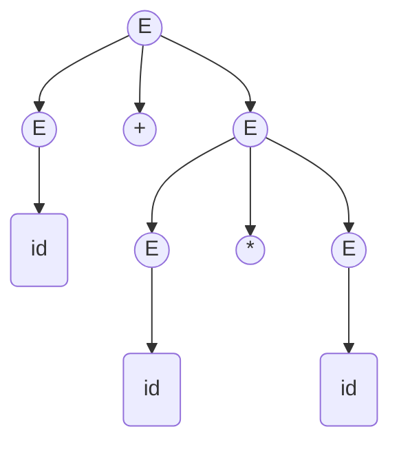
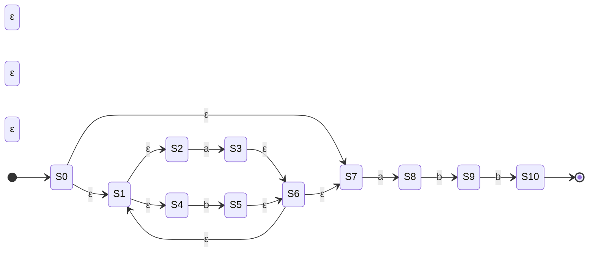
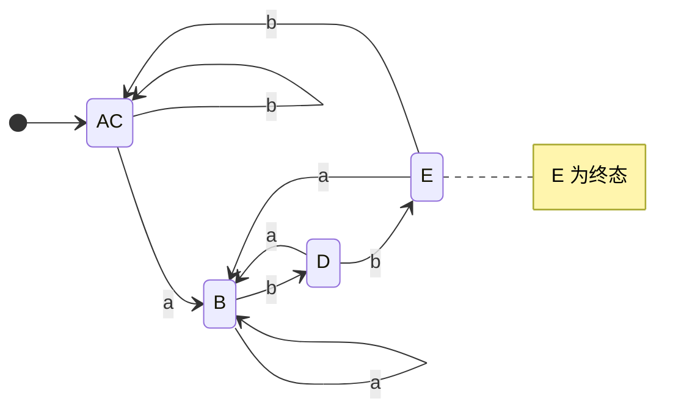
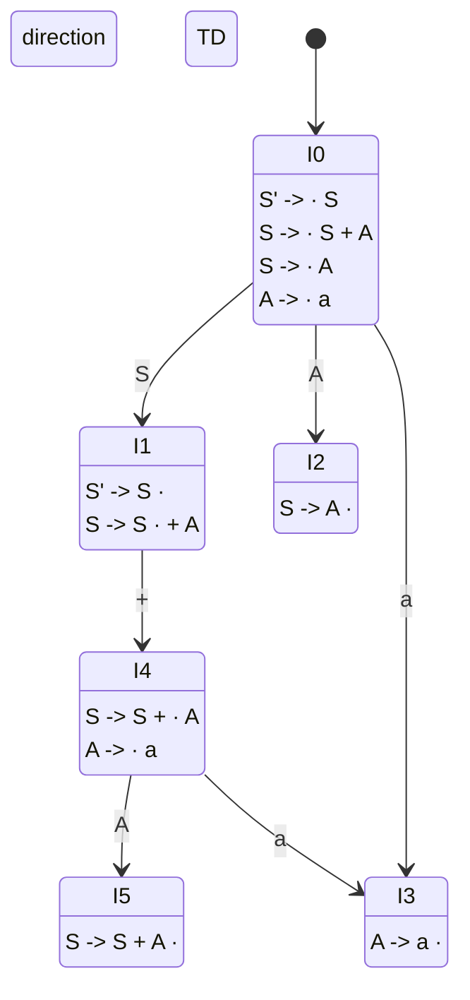
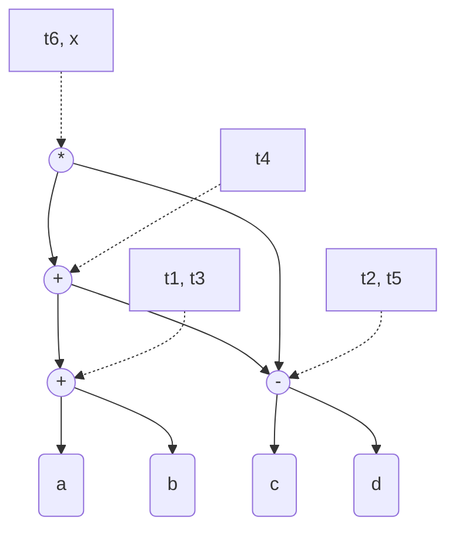

# 编译原理期末复习模拟卷 - 参考答案

### 一、 语言及其文法（15分）

**1. 推导过程 (6分)**

- **最左推导：** $E \Rightarrow E * E \Rightarrow E + E * E \Rightarrow \mathbf{id} + E * E \Rightarrow \mathbf{id} + \mathbf{id} * E \Rightarrow \mathbf{id} + \mathbf{id} * \mathbf{id}$ *(注：也可以先推导加号* $E \Rightarrow E + E \Rightarrow \mathbf{id} + E \Rightarrow \mathbf{id} + E * E \dots$*)*
- **最右推导：** $E \Rightarrow E + E \Rightarrow E + E * E \Rightarrow E + E * \mathbf{id} \Rightarrow E + \mathbf{id} * \mathbf{id} \Rightarrow \mathbf{id} + \mathbf{id} * \mathbf{id}$

**2. 语法分析树 (4分)** 对应上述推导，可以画出其中一棵树（由于有二义性，画出任意一棵结构合理即可）：



**3. 二义性证明 (5分)** **证明：** 对于句子 $\mathbf{id} + \mathbf{id} * \mathbf{id}$，可以构造出两棵完全不同的语法分析树（一棵优先结合加法，一棵优先结合乘法），或者可以写出两个不同的最左推导： 推导1：$E \Rightarrow E + E \Rightarrow \dots$ 推导2：$E \Rightarrow E * E \Rightarrow \dots$ 由于一个句子存在两棵（或以上）不同的语法分析树，因此该文法是二义性文法。

### 二、 词法分析（20分）

**1. Thompson 算法构造 NFA (6分)** $RE = (a \mid b)^* a b b$ 的 NFA 概念图（主要体现并联和串联以及克林闭包的结构）：



**2. 子集构造法确定化为 DFA (8分)** 计算 $\varepsilon$-closure 和 move，得到的未化简的 DFA 状态转换表如下： 设初始状态 $A = \varepsilon\text{-closure}(S0) = \{0, 1, 2, 4, 7\}$

| 状态  | 接受输入 `a`            | 接受输入 `b`             | 是否终态 |
| ----- | ----------------------- | ------------------------ | -------- |
| **A** | $B = \{1,2,3,4,6,7,8\}$ | $C = \{1,2,4,5,6,7\}$    | 否       |
| **B** | $B$                     | $D = \{1,2,4,5,6,7,9\}$  | 否       |
| **C** | $B$                     | $C$                      | 否       |
| **D** | $B$                     | $E = \{1,2,4,5,6,7,10\}$ | 否       |
| **E** | $B$                     | $C$                      | **是**   |

**3. Hopcroft 最小化 DFA (6分)** 初始划分：终态组 $\Pi_1 = \{E\}$，非终态组 $\Pi_2 = \{A, B, C, D\}$。 对 $\Pi_2$ 考查：

- 输入 `b` 时：$A, B, C$ 转向 $\Pi_2$ 内部（$C, D, C$）；而 $D$ 转向终态 $E (\in \Pi_1)$。所以将 $D$ 分离。
- 当前划分：$\{E\}, \{D\}, \{A, B, C\}$。
- 继续考查 $\{A, B, C\}$ 输入 `b`：$A \to C, C \to C$，而 $B \to D$。所以将 $B$ 分离。
- 当前划分：$\{E\}, \{D\}, \{B\}, \{A, C\}$。
- 考查 $\{A, C\}$：输入 `a` 均转向 $B$，输入 `b` 均转向 $C$。不可再分。 合并等价状态 $A$ 和 $C$（记为 $AC$），最终最小化 DFA 如下：



### 三、 自顶向下语法分析：LL(1) 分析（15分）

**1. FIRST 与 FOLLOW 集合 (6分)**

- $\text{FIRST}(S) = \{a, b, c\}$
- $\text{FIRST}(A) = \{a, \varepsilon\}$
- $\text{FIRST}(B) = \{b, c\}$
- $\text{FOLLOW}(S) = \{\$\}$
- $\text{FOLLOW}(A) = \text{FIRST}(B) = \{b, c\}$
- $\text{FOLLOW}(B) = \text{FOLLOW}(S) = \{\$\}$

**2. LL(1) 预测分析表 (6分)** 根据 $SELECT$ 集填表：

| 非终结符 | `a`         | `b`                 | `c`                 | `$`  |
| -------- | ----------- | ------------------- | ------------------- | ---- |
| **S**    | $S \to A B$ | $S \to A B$         | $S \to A B$         |      |
| **A**    | $A \to a A$ | $A \to \varepsilon$ | $A \to \varepsilon$ |      |
| **B**    |             | $B \to b B$         | $B \to c$           |      |

*判断：表中没有多重定义的单元格，因此该文法**是 LL(1) 文法**。*

**3. 分析过程 (3分)**

| 步骤 | 符号栈          | 输入串    | 动作                |
| ---- | --------------- | --------- | ------------------- |
| 1    | `$` `S`         | `a b c $` | $S \to A B$         |
| 2    | `$` `B` `A`     | `a b c $` | $A \to a A$         |
| 3    | `$` `B` `A` `a` | `a b c $` | 匹配 `a`            |
| 4    | `$` `B` `A`     | `b c $`   | $A \to \varepsilon$ |
| 5    | `$` `B`         | `b c $`   | $B \to b B$         |
| 6    | `$` `B` `b`     | `b c $`   | 匹配 `b`            |
| 7    | `$` `B`         | `c $`     | $B \to c$           |
| 8    | `$` `c`         | `c $`     | 匹配 `c`            |
| 9    | `$`             | `$`       | 接受 (Accept)       |

### 四、 自底向上语法分析：SLR(1) 分析（20分）

**1. LR(0) 项目集规范族 (8分)**



**2. 冲突及 SLR(1) 解决 (4分)**

- **冲突状态：** 状态 `I1`。
- **冲突类型：** 存在项目 $S' \to S \cdot$（归约项）和 $S \to S \cdot + A$（移入项），产生**移入-归约冲突**。
- **解决：** 计算 $\text{FOLLOW}(S') = \{\$\}$。因为下一个输入符号 `+` 不属于 $\text{FOLLOW}(S')$，因此遇到 `+` 时执行移入操作（Shift），只有遇到 `$` 时才执行归约操作（Reduce）。冲突解决，文法属于 SLR(1)。

**3. SLR(1) 分析表 (5分)** $\text{FOLLOW}(S) = \{+, \$\}$，$\text{FOLLOW}(A) = \{+, \$\}$

| 状态  | a    | +    | $    | S    | A    |
| ----- | ---- | ---- | ---- | ---- | ---- |
| **0** | s3   |      |      | 1    | 2    |
| **1** |      | s4   | acc  |      |      |
| **2** |      | r2   | r2   |      |      |
| **3** |      | r3   | r3   |      |      |
| **4** | s3   |      |      |      | 5    |
| **5** |      | r1   | r1   |      |      |

**4. 移入-归约过程 (3分)**

| 步骤 | 状态栈    | 符号栈    | 输入串    | 动作                    |
| ---- | --------- | --------- | --------- | ----------------------- |
| 1    | `0`       | `$`       | `a + a $` | 移入 a (s3)             |
| 2    | `0 3`     | `$ a`     | `+ a $`   | 归约 $A \to a$ (r3)     |
| 3    | `0 2`     | `$ A`     | `+ a $`   | 归约 $S \to A$ (r2)     |
| 4    | `0 1`     | `$ S`     | `+ a $`   | 移入 + (s4)             |
| 5    | `0 1 4`   | `$ S +`   | `a $`     | 移入 a (s3)             |
| 6    | `0 1 4 3` | `$ S + a` | `$`       | 归约 $A \to a$ (r3)     |
| 7    | `0 1 4 5` | `$ S + A` | `$`       | 归约 $S \to S + A$ (r1) |
| 8    | `0 1`     | `$ S`     | `$`       | 接受 (acc)              |

### 五、 中间代码生成与回填（10分）

**四元式序列（三地址码）：** 假设当前生成的指令序号从 100 开始：

```
100: if (x < y) goto 102
101: goto 106          // 循环出口，回填目标
102: if (a > b) goto 104
103: goto 100          // if 条件不满足，回到 while 判断
104: t1 = z + 1        // z = z + 1 翻译
105: z = t1
106: goto 100          // 循环体结束，回到 while 判断
107: ...               // 循环外部指令
```

*(注：步骤 103 也可以不生成直接让 if false 落下，但作为标准控制流模板，写出 jump 以展示回填思想是正确的)*

### 六、 运行存储分配（10分）

**1 & 2. 栈帧结构与动态/静态链 (10分)** 当执行到断点 A 时，调用顺序为：`Main -> P1 -> P2`。

- **动态链（控制链）**：指向**调用者**的栈帧。`P2` 的动态链指向 `P1`，`P1` 的动态链指向 `Main`。
- **静态链（访问链）**：指向在**源代码中嵌套其的外层过程**的栈帧。`P2` 嵌套在 `P1` 中，所以静态链指向 `P1`；`P1` 嵌套在 `Main` 中，静态链指向 `Main`。

```mermaid
graph TD
    subgraph 运行栈 (Stack)
        direction BT
        
        subgraph Main_Frame [Main 活动记录]
            M_DL[动态链: nil]
            M_SL[静态链: nil]
            M_Local[局部变量: x]
        end
        
        subgraph P1_Frame [P1 活动记录]
            P1_DL[动态链]
            P1_SL[静态链]
            P1_Local[局部变量: y]
        end
        
        subgraph P2_Frame [P2 活动记录]
            P2_DL[动态链]
            P2_SL[静态链]
            P2_Local[局部变量: z]
        end
    end

    P2_DL -.->|动态链 (调用者)| P1_Frame
    P1_DL -.->|动态链 (调用者)| Main_Frame
    
    P2_SL ==>|静态链 (词法外层)| P1_Frame
    P1_SL ==>|静态链 (词法外层)| Main_Frame
```

*(为了获取 `x` 的值，`P2` 会顺着静态链查找两次：`P2` -> `P1` -> `Main`，从而找到 `x`。)*

### 七、 代码优化：DAG 与基本块优化（10分）

**1. 构造 DAG (5分)** 原代码分析：

1. $t_1 = a + b$
2. $t_2 = c - d$
3. $t_3 = a + b$ （公共子表达式，复用 $t_1$）
4. $t_4 = t_3 + t_2 \Rightarrow t_4 = t_1 + t_2$
5. $t_5 = c - d$ （公共子表达式，复用 $t_2$）
6. $t_6 = t_4 * t_5 \Rightarrow t_6 = t_4 * t_2$
7. $x = t_6$ （最终值）

DAG 图如下：



**2. 优化后的三地址码序列 (5分)** 根据 DAG 重构代码，删除不再使用的中间临时变量（只保留最终被要求活跃的变量 `x`，或无法消去的中间节点表示）：

```
t1 = a + b
t2 = c - d
t4 = t1 + t2
x = t4 * t2
```

*(消除了对* $t_3, t_5, t_6$ *的多余计算和赋值)*